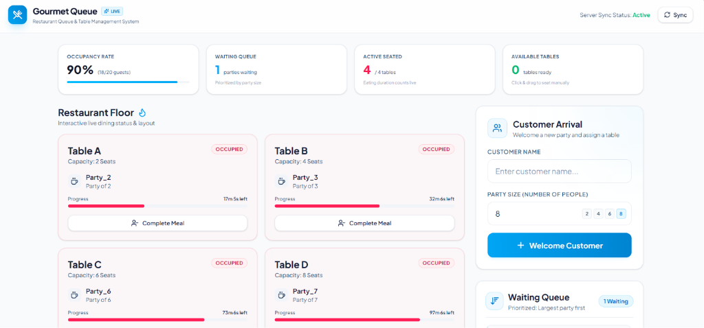

Restaurant Queue Management System built with **Laravel 13** and **React 19 + TypeScript**.

## Features

- Automatic table assignment
- Priority waiting queue (largest party first)
- Interactive dashboard
- Drag & Drop seating
- Live countdown timer
- Force Complete customer
- History with search, filter, and sorting
- Backend & Frontend Unit Tests

---

# Tech Stack

### Backend
- Laravel 13
- PHP 8.3+
- PostgreSQL / SQLite
- Redis
- PHPUnit

### Frontend
- React 19
- TypeScript
- Vite
- Tailwind CSS
- Zustand
- TanStack Query
- Vitest

---

# Installation

```bash
git clone https://github.com/Waynra/Restaurant-queue-system.git

cd Restaurant-queue-system

composer install
npm install

cp .env.example .env

php artisan key:generate

php artisan migrate:fresh --seed

php artisan serve
npm run dev
```

Application:

```
http://localhost:8000
```

---

# Testing

Backend

```bash
php artisan test
```

Frontend

```bash
npm test
```

Production Build

```bash
npm run build
```

---

# API Endpoints

| Method | Endpoint |
|---------|----------|
| POST | `/api/arrive` |
| GET | `/api/status` |
| POST | `/api/seat` |
| POST | `/api/serve/{customer}` |
| GET | `/api/history` |

---

# Business Rules

Restaurant Tables

| Table | Capacity |
|------|---------:|
| A | 2 |
| B | 4 |
| C | 6 |
| D | 8 |

Rules

- Smallest suitable table is selected.
- No oversize assignment.
- Waiting queue uses largest party first.
- Dining duration = `(party × 15) + random(5–15 minutes)`.

---

# Folder Structure

```
app/
database/
resources/
routes/
tests/
Dockerfile
docker-compose.yml
```

---

# Assumptions & Challenges

### Assumptions

- Four fixed tables (2, 4, 6, and 8 seats).
- One party occupies one table.
- Waiting queue prioritizes larger parties.

### Challenges

- Implementing priority queue with smallest-table assignment.
- Synchronizing live countdown timer.
- Keeping frontend and backend state consistent.

---

# Bonus – Revenue Optimization

Reserve large tables for a short period before assigning them to smaller parties.

```text
if small_table_available:
    assign()

else if only_large_table_available:

    if waiting_time < HOLD_LIMIT:
        keep_waiting()

    else:
        assign_large_table()
```

**Pros**

- Better table utilization
- Better support for large parties
- Potentially higher revenue

**Cons**

- Small parties may wait longer
- Hold duration must be tuned

---

# CI/CD

GitHub Actions automatically:

- Install dependencies
- Run Laravel tests
- Run React tests
- Build production assets

---

# Screenshot



---

# Author

**Wahyu Nur Agustusanto**

Take Home Test – Fullstack Developer
